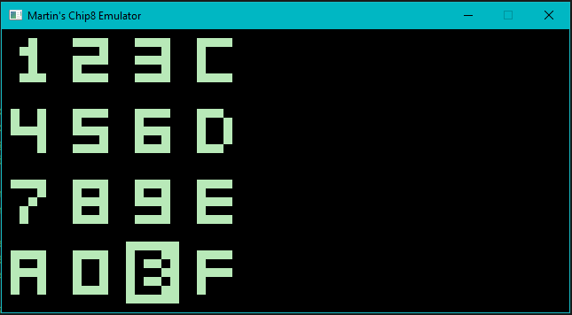

# Simple-Chip-8-Emulator
This is a Chip-8 Interpreter written in C++, interfaced using SDL2.

## Screenshots

### The font set for Chip 8

### The emulator running Pong

### The emulator running Tetris. Yeah, I suck at Tetris.

## References

A list of sites that I referred to for the project:

* http://www.multigesture.net/articles/how-to-write-an-emulator-chip-8-interpreter/
* http://devernay.free.fr/hacks/chip8/C8TECH10.HTM
* https://en.wikipedia.org/wiki/CHIP-8#cite_note-16

## ROM Sources
* https://github.com/loktar00/chip8
